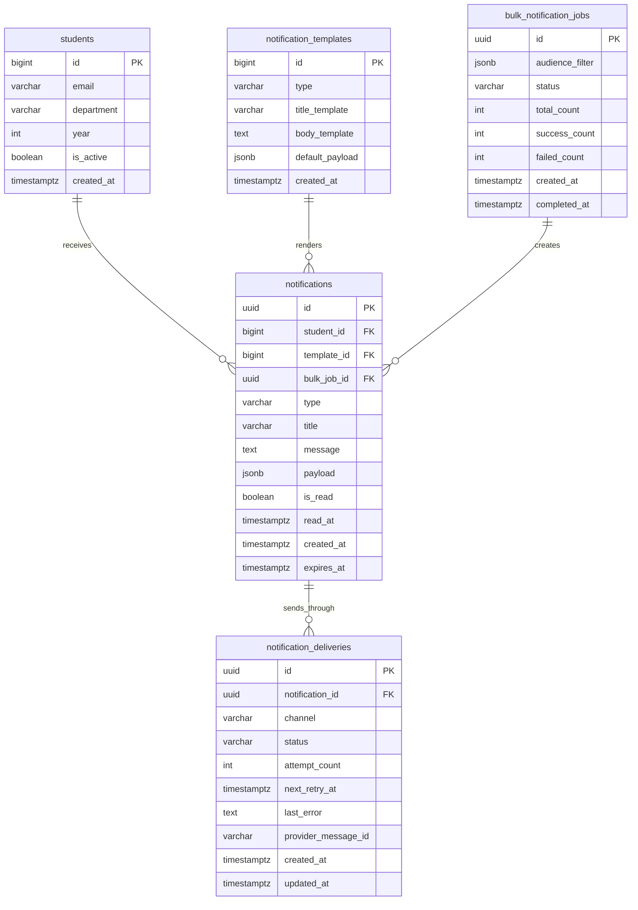

# Notification System Design

## Scope

This document designs a production-quality campus notification backend for sending, storing, reading, and prioritizing notifications such as placements, results, and events. The implementation part of this assessment is intentionally database-free for the Priority Inbox algorithm, but the system design stages describe the production architecture that should be used when persistent storage is allowed.

---

## Stage 1: REST API Design

### API conventions

- Use plural resource names: `/notifications`, `/students/{studentId}/notifications`.
- Use JSON request and response bodies.
- Use camelCase for API fields.
- Use ISO 8601 timestamps in UTC.
- Use cursor-based pagination for inbox reads.
- Use idempotency keys for create/bulk APIs to protect retries from duplicates.
- Return a consistent response envelope:

```json
{
  "success": true,
  "data": {},
  "meta": {}
}
```

### Common headers

| Header | Required | Purpose |
| --- | --- | --- |
| `Authorization: Bearer <token>` | Yes | Authenticates the caller |
| `Content-Type: application/json` | For body requests | Declares JSON payload |
| `Accept: application/json` | Recommended | Requests JSON response |
| `Idempotency-Key` | For create/bulk | Prevents duplicate sends during retries |
| `X-Request-ID` | Recommended | Traceability across services |

### Create notification

`POST /notifications`

Request:

```json
{
  "studentId": 1042,
  "type": "placement",
  "title": "Placement Drive Scheduled",
  "message": "A product company drive starts tomorrow at 10:00 AM.",
  "payload": {
    "companyId": 91,
    "driveId": 318
  },
  "channels": ["in_app", "email"],
  "expiresAt": "2026-07-08T00:00:00.000Z"
}
```

Response `201 Created`:

```json
{
  "success": true,
  "data": {
    "notificationId": "noti_01JZ2H7F7M7AV2G3C2R9A1QF6R",
    "status": "queued"
  }
}
```

### Get student inbox

`GET /students/{studentId}/notifications?limit=20&cursor=eyJjcmVhdGVkQXQiOiIyMDI2...&isRead=false&type=placement`

Response `200 OK`:

```json
{
  "success": true,
  "data": [
    {
      "notificationId": "noti_01JZ2H7F7M7AV2G3C2R9A1QF6R",
      "studentId": 1042,
      "type": "placement",
      "title": "Placement Drive Scheduled",
      "message": "A product company drive starts tomorrow at 10:00 AM.",
      "isRead": false,
      "createdAt": "2026-07-01T10:15:00.000Z"
    }
  ],
  "meta": {
    "nextCursor": "eyJjcmVhdGVkQXQiOiIyMDI2..."
  }
}
```

### Mark one notification as read

`PATCH /notifications/{notificationId}/read`

Response `200 OK`:

```json
{
  "success": true,
  "data": {
    "notificationId": "noti_01JZ2H7F7M7AV2G3C2R9A1QF6R",
    "isRead": true,
    "readAt": "2026-07-01T10:20:00.000Z"
  }
}
```

### Mark all as read

`PATCH /students/{studentId}/notifications/read-all`

Response:

```json
{
  "success": true,
  "data": {
    "updatedCount": 42
  }
}
```

### Bulk notify all

`POST /notifications/bulk`

Request:

```json
{
  "audience": {
    "department": "CSE",
    "year": 4
  },
  "type": "placement",
  "title": "Campus Drive Open",
  "message": "Eligible students can apply before 6 PM.",
  "channels": ["in_app", "email"]
}
```

Response `202 Accepted`:

```json
{
  "success": true,
  "data": {
    "jobId": "job_01JZ2HS6KS9T6YB3A1N1AE9H7M",
    "status": "accepted"
  }
}
```

### JSON schema for notification

```json
{
  "type": "object",
  "required": ["studentId", "type", "title", "message"],
  "properties": {
    "studentId": { "type": "integer", "minimum": 1 },
    "type": { "type": "string", "enum": ["placement", "result", "event"] },
    "title": { "type": "string", "minLength": 1, "maxLength": 120 },
    "message": { "type": "string", "minLength": 1, "maxLength": 2000 },
    "payload": { "type": "object" },
    "channels": {
      "type": "array",
      "items": { "type": "string", "enum": ["in_app", "email", "sms", "push"] }
    },
    "expiresAt": { "type": "string", "format": "date-time" }
  }
}
```

### Real-time notification architecture

1. API validates and stores the notification.
2. API publishes a `notification.created` event to a message broker.
3. WebSocket gateway subscribes to notification events.
4. Gateway maps `studentId` to active socket connections.
5. Gateway pushes the notification to connected clients.
6. If the student is offline, the notification remains available through the inbox API.

This separates durable storage from real-time delivery. WebSockets improve freshness, while the database remains the source of truth.

---

## Stage 2: Database Selection, Schema, Queries

### Database choice

Use PostgreSQL as the primary database.

Reasons:

- Strong consistency for read/unread state.
- ACID transactions for notification creation and delivery job creation.
- Good indexing support for high-volume inbox queries.
- JSONB support for flexible metadata payloads.
- Mature partitioning support for large notification tables.

Use Redis for caching and WebSocket fanout metadata, not as the source of truth.

### ER diagram



### Schema

```sql
CREATE TABLE students (
  id BIGSERIAL PRIMARY KEY,
  email VARCHAR(255) NOT NULL UNIQUE,
  department VARCHAR(50) NOT NULL,
  year INT NOT NULL,
  is_active BOOLEAN NOT NULL DEFAULT TRUE,
  created_at TIMESTAMPTZ NOT NULL DEFAULT NOW()
);

CREATE TABLE notification_templates (
  id BIGSERIAL PRIMARY KEY,
  type VARCHAR(30) NOT NULL CHECK (type IN ('placement', 'result', 'event')),
  title_template VARCHAR(120) NOT NULL,
  body_template TEXT NOT NULL,
  default_payload JSONB NOT NULL DEFAULT '{}',
  created_at TIMESTAMPTZ NOT NULL DEFAULT NOW()
);

CREATE TABLE bulk_notification_jobs (
  id UUID PRIMARY KEY,
  audience_filter JSONB NOT NULL,
  status VARCHAR(30) NOT NULL CHECK (status IN ('accepted', 'processing', 'completed', 'failed')),
  total_count INT NOT NULL DEFAULT 0,
  success_count INT NOT NULL DEFAULT 0,
  failed_count INT NOT NULL DEFAULT 0,
  created_at TIMESTAMPTZ NOT NULL DEFAULT NOW(),
  completed_at TIMESTAMPTZ
);

CREATE TABLE notifications (
  id UUID PRIMARY KEY,
  student_id BIGINT NOT NULL REFERENCES students(id),
  template_id BIGINT REFERENCES notification_templates(id),
  bulk_job_id UUID REFERENCES bulk_notification_jobs(id),
  type VARCHAR(30) NOT NULL CHECK (type IN ('placement', 'result', 'event')),
  title VARCHAR(120) NOT NULL,
  message TEXT NOT NULL,
  payload JSONB NOT NULL DEFAULT '{}',
  is_read BOOLEAN NOT NULL DEFAULT FALSE,
  read_at TIMESTAMPTZ,
  created_at TIMESTAMPTZ NOT NULL DEFAULT NOW(),
  expires_at TIMESTAMPTZ
);

CREATE TABLE notification_deliveries (
  id UUID PRIMARY KEY,
  notification_id UUID NOT NULL REFERENCES notifications(id),
  channel VARCHAR(30) NOT NULL CHECK (channel IN ('in_app', 'email', 'sms', 'push')),
  status VARCHAR(30) NOT NULL CHECK (status IN ('pending', 'sent', 'failed', 'dead')),
  attempt_count INT NOT NULL DEFAULT 0,
  next_retry_at TIMESTAMPTZ,
  last_error TEXT,
  provider_message_id VARCHAR(255),
  created_at TIMESTAMPTZ NOT NULL DEFAULT NOW(),
  updated_at TIMESTAMPTZ NOT NULL DEFAULT NOW()
);
```

### Indexes

```sql
CREATE INDEX idx_notifications_student_created
ON notifications (student_id, created_at DESC);

CREATE INDEX idx_notifications_student_unread_created
ON notifications (student_id, created_at DESC)
WHERE is_read = FALSE;

CREATE INDEX idx_notifications_student_type_created
ON notifications (student_id, type, created_at DESC);

CREATE INDEX idx_notification_deliveries_retry
ON notification_deliveries (status, next_retry_at)
WHERE status = 'failed';

CREATE INDEX idx_students_audience
ON students (department, year)
WHERE is_active = TRUE;
```

### SQL queries

Fetch unread inbox:

```sql
SELECT id, student_id, type, title, message, payload, is_read, created_at
FROM notifications
WHERE student_id = $1
  AND is_read = FALSE
ORDER BY created_at DESC
LIMIT $2;
```

Cursor pagination:

```sql
SELECT id, student_id, type, title, message, payload, is_read, created_at
FROM notifications
WHERE student_id = $1
  AND created_at < $2
ORDER BY created_at DESC
LIMIT $3;
```

Mark one as read:

```sql
UPDATE notifications
SET is_read = TRUE,
    read_at = NOW()
WHERE id = $1
  AND student_id = $2
  AND is_read = FALSE;
```

Create delivery rows:

```sql
INSERT INTO notification_deliveries (
  id, notification_id, channel, status, next_retry_at
)
SELECT gen_random_uuid(), $1, channel, 'pending', NOW()
FROM unnest($2::varchar[]) AS channel;
```

### Scalability discussion

- Partition `notifications` by time, such as monthly partitions, if retention is long and write volume is high.
- Archive old notifications to cheaper storage after the retention period.
- Keep inbox queries student-scoped to avoid full-table scans.
- Use read replicas for high read traffic.
- Use queue workers for delivery so API latency is not tied to email/SMS/push providers.

---

## Stage 3: Query Optimization

Query to analyze:

```sql
SELECT *
FROM notifications
WHERE studentID = 1042
AND isRead = false
ORDER BY createdAt DESC;
```

### Why this can be slow

- `SELECT *` reads every column, including large text or JSON payloads that may not be needed.
- Without an index on `studentID` and `createdAt`, the database scans many rows.
- Without an index matching `isRead = false`, unread filtering may still scan a large student history.
- Sorting by `createdAt DESC` is expensive if rows are not already available in that order.
- Mixed casing (`studentID`, `isRead`, `createdAt`) is harder to maintain than consistent snake_case in SQL.

### Time complexity

- Without a useful index: filtering is `O(n)` and sorting matching rows is `O(m log m)`.
- With `(student_id, created_at DESC)` index: lookup is approximately `O(log n + m)`, with rows already ordered.
- With a partial unread index: lookup is approximately `O(log u + k)`, where `u` is unread rows and `k` is returned rows.

### Optimized query

```sql
SELECT id, type, title, message, created_at
FROM notifications
WHERE student_id = 1042
  AND is_read = FALSE
ORDER BY created_at DESC
LIMIT 20;
```

### Proper index

```sql
CREATE INDEX idx_notifications_unread_inbox
ON notifications (student_id, created_at DESC)
WHERE is_read = FALSE;
```

This index is smaller than indexing all notifications because it stores only unread rows.

### Covering index

For extremely hot inbox previews:

```sql
CREATE INDEX idx_notifications_unread_inbox_covering
ON notifications (student_id, created_at DESC)
INCLUDE (id, type, title)
WHERE is_read = FALSE;
```

A covering index can avoid heap reads for preview queries, but it increases write cost and index size.

### Why indexing every column is bad

- Every insert/update must update many indexes.
- More indexes increase storage cost.
- The optimizer has more choices and may pick suboptimal plans.
- Low-cardinality columns alone, such as `is_read`, are often poor indexes.
- Unused indexes slow writes without improving reads.

### Placement notifications in the last 7 days

```sql
SELECT id, student_id, title, message, payload, created_at
FROM notifications
WHERE student_id = $1
  AND type = 'placement'
  AND created_at >= NOW() - INTERVAL '7 days'
ORDER BY created_at DESC
LIMIT 50;
```

Supporting index:

```sql
CREATE INDEX idx_notifications_student_type_recent
ON notifications (student_id, type, created_at DESC);
```

---

## Stage 4: Caching Strategy

### Redis usage

Use Redis for:

- Inbox preview cache: `student:{studentId}:inbox:preview`
- Unread count cache: `student:{studentId}:unread_count`
- WebSocket connection registry: `student:{studentId}:sockets`
- Rate limiting keys for write APIs
- Distributed locks for rare coordination paths

### Cache-aside pattern

1. API checks Redis for inbox preview.
2. On miss, API reads PostgreSQL.
3. API writes the result to Redis with a short TTL.
4. On new notification/read update, invalidate or update affected keys.

Recommended TTLs:

- Inbox preview: 30 to 120 seconds.
- Unread count: 5 to 30 minutes with write-through updates.
- WebSocket registry: heartbeat-based TTL.

### Pagination and lazy loading

- Use cursor pagination instead of offset pagination.
- Load the first 20 notifications first.
- Load older notifications lazily as the user scrolls.
- Cursor should encode `createdAt` and `notificationId` to avoid duplicate/missing rows when timestamps tie.

### WebSockets

- Use WebSockets for real-time in-app notifications.
- Authenticate the socket connection.
- Store active socket mappings in Redis.
- Publish events through Redis Pub/Sub, Kafka, or RabbitMQ so all gateway instances can deliver events.

### Horizontal scaling

- API servers remain stateless.
- WebSocket gateways scale horizontally with shared Redis connection state.
- Workers scale by queue partition or consumer group.
- PostgreSQL scales with read replicas and partitioning.
- Redis Cluster can be used when cache size or throughput grows.

### Performance improvements

- Cache unread counts.
- Avoid `SELECT *`.
- Use partial indexes for unread inbox.
- Use batch inserts for bulk sends.
- Use async workers for provider delivery.
- Use compression for large response bodies.

### Tradeoffs

| Decision | Benefit | Tradeoff |
| --- | --- | --- |
| Redis cache | Lower latency and database load | Possible stale reads |
| WebSockets | Real-time delivery | Stateful connection management |
| Cursor pagination | Stable performance at scale | More complex client state |
| Partial indexes | Fast focused reads | Only help matching query patterns |
| Queue-based delivery | Reliable and scalable | Eventual consistency |

---

## Stage 5: Reliable Bulk Notification Architecture

### Architecture

```text
Admin/API
  |
  v
Bulk Notification API
  |
  | transaction: create job
  v
PostgreSQL
  |
  v
Message Queue Topic: bulk-notification-jobs
  |
  v
Audience Resolver Worker
  |
  v
Message Queue Topic: notification-delivery
  |
  v
Delivery Workers
  |
  v
Email/SMS/Push/In-App Providers
  |
  v
Dead Letter Queue for exhausted failures
```

### RabbitMQ or Kafka

RabbitMQ is a strong fit when:

- Work queues and acknowledgements are the primary need.
- Per-message retry and DLQ routing should be simple.
- Ordering is not the main requirement.

Kafka is a strong fit when:

- Very high throughput is required.
- Events must be replayable.
- Multiple downstream consumers need the same notification stream.

For a campus hiring assessment, RabbitMQ is simpler and perfectly suitable. Kafka is preferable if the institution has many campuses, analytics consumers, and high event volume.

### Retry mechanism

- Use exponential backoff with jitter.
- Retry only transient failures such as provider timeouts and 5xx responses.
- Do not retry permanent failures such as invalid phone/email.
- Store `attempt_count`, `next_retry_at`, and `last_error`.
- Acknowledge queue messages only after durable state is updated.

### Dead Letter Queue

Messages move to DLQ when:

- Max retry attempts are exhausted.
- Payload validation fails.
- Provider returns permanent failure.
- Worker repeatedly crashes for that message.

DLQ records must include:

- Original payload.
- Failure reason.
- Attempt count.
- Last error.
- Correlation/request ID.

### Idempotency

- Require `Idempotency-Key` for bulk create requests.
- Use unique constraints on `(job_id, student_id, type)` where appropriate.
- Use provider idempotency keys when supported.
- Delivery workers should check current delivery status before sending.

### Transactions

- Create the bulk job and outbox event in the same transaction.
- A separate outbox publisher reads unsent events and publishes to the queue.
- This prevents the classic bug where the database commit succeeds but queue publish fails.

### Failure recovery

- If API crashes after job creation, the outbox publisher still publishes.
- If worker crashes during processing, the queue re-delivers unacknowledged messages.
- If provider is down, retries are delayed.
- If retries are exhausted, DLQ preserves the message for manual or automated repair.

### Concurrency

- Partition work by `studentId` or `jobId` to avoid duplicate sends.
- Use worker prefetch limits to prevent one worker from holding too many messages.
- Use optimistic status updates:

```sql
UPDATE notification_deliveries
SET status = 'sent'
WHERE id = $1
  AND status IN ('pending', 'failed');
```

### Revised pseudocode

```javascript
async function createBulkNotification(request) {
  validateRequest(request);

  return database.transaction(async (transaction) => {
    const existingJob = await findJobByIdempotencyKey(
      request.idempotencyKey,
      transaction,
    );

    if (existingJob) {
      return existingJob;
    }

    const job = await insertBulkJob(
      {
        audienceFilter: request.audience,
        status: 'accepted',
        idempotencyKey: request.idempotencyKey,
      },
      transaction,
    );

    await insertOutboxEvent(
      {
        eventType: 'bulk_notification.accepted',
        aggregateId: job.id,
        payload: { jobId: job.id },
      },
      transaction,
    );

    return job;
  });
}

async function processBulkJob(message) {
  const job = await loadJob(message.jobId);
  await markJobProcessing(job.id);

  for await (const studentBatch of streamEligibleStudents(job.audienceFilter)) {
    const notifications = studentBatch.map((student) =>
      buildNotification(job, student),
    );

    await database.transaction(async (transaction) => {
      await insertNotifications(notifications, transaction);
      await insertDeliveryRows(notifications, transaction);
    });

    await publishDeliveryMessages(notifications);
  }

  await markJobCompleted(job.id);
}

async function processDelivery(message) {
  const delivery = await loadDelivery(message.deliveryId);

  if (!delivery || delivery.status === 'sent' || delivery.status === 'dead') {
    acknowledge(message);
    return;
  }

  try {
    const providerResponse = await sendThroughProvider(delivery);
    await markDeliverySent(delivery.id, providerResponse.messageId);
    acknowledge(message);
  } catch (error) {
    if (isPermanentFailure(error) || delivery.attemptCount >= MAX_ATTEMPTS) {
      await markDeliveryDead(delivery.id, error.message);
      await publishToDeadLetterQueue(message, error);
      acknowledge(message);
      return;
    }

    const retryAt = calculateBackoffWithJitter(delivery.attemptCount);
    await markDeliveryFailed(delivery.id, error.message, retryAt);
    requeueWithDelay(message, retryAt);
  }
}
```

---

## Stage 6: Priority Inbox Algorithm

### Requirement

Fetch notifications from a protected API, do not use a database, and return the top 10 notifications using this ranking:

1. Placement
2. Result
3. Event

If two notifications have the same priority, the newest notification comes first.

### Implementation file

`priorityInbox.js`

The implementation uses:

- `axios` for protected API calls.
- `dotenv` for environment variables.
- A bounded min-heap of size 10.

### Why a bounded heap

If there are `n` notifications and only top `k = 10` are needed:

- Full sorting costs `O(n log n)`.
- A bounded heap costs `O(n log k)`, which becomes `O(n)` in practice because `k` is fixed at 10.
- Memory usage is `O(k)`.

### Maintaining Top 10 as new notifications arrive

Maintain a min-heap containing the current top 10, with the worst notification at the root.

For each incoming notification:

1. Compute priority rank and timestamp.
2. If heap size is below 10, insert it.
3. If heap is full and the new notification is better than the root, replace the root.
4. Otherwise discard it.

This keeps updates at `O(log 10)`, effectively constant time.

---

## Folder Structure

```text
Campus-Evaluation-BE/
├── logging-middleware/
├── vehicle-scheduler-be/
│   └── src/
│       ├── controllers/
│       ├── middleware/
│       ├── routes/
│       ├── services/
│       └── utils/
└── notification-app-be/
    ├── notification_system_design.md
    ├── priorityInbox.js
    ├── package.json
    ├── package-lock.json
    └── .env
```

---

## Environment Variables

Add these values to `notification-app-be/.env`:

```env
BASE_URL=https://your-assessment-host
ACCESS_TOKEN=your_bearer_token
NOTIFICATIONS_API=/evaluation-service/notifications
```

`NOTIFICATIONS_API` is preferred. `priorityInbox.js` also supports `NOTIFICATIONS_ENDPOINT` for compatibility, and if both are missing it falls back to `/evaluation-service/notifications`.

---

## How to Run

Install dependencies:

```bash
cd Campus-Evaluation-BE/notification-app-be
npm install
```

Run the Priority Inbox script:

```bash
node priorityInbox.js
```

Use as a module:

```javascript
const { getPriorityInbox } = require('./priorityInbox');

async function main() {
  const inbox = await getPriorityInbox();
  return inbox;
}
```

---

## Postman Instructions

### Protected Notification API

Request:

- Method: `GET`
- URL: `{{BASE_URL}}/evaluation-service/notifications`
- Headers:
  - `Authorization: Bearer {{ACCESS_TOKEN}}`
  - `Accept: application/json`

Expected upstream response shape:

```json
{
  "notifications": [
    {
      "ID": 1,
      "Type": "Placement",
      "Title": "Campus Drive",
      "Message": "Drive starts tomorrow",
      "CreatedAt": "2026-07-01T09:30:00.000Z"
    }
  ]
}
```

### Local Priority Inbox verification

The submitted implementation is a Node.js module/script, not a database-backed server. To test it with Postman as an HTTP endpoint, wrap `getPriorityInbox()` in an Express route:

```javascript
const express = require('express');
const { getPriorityInbox } = require('./priorityInbox');

const app = express();

app.get('/priority-inbox', async (_req, res) => {
  const data = await getPriorityInbox();
  res.json({ success: true, data });
});

app.listen(3000);
```

Then call:

- Method: `GET`
- URL: `http://localhost:3000/priority-inbox`

---

## Sample Output

```json
{
  "success": true,
  "data": [
    {
      "ID": 12,
      "Type": "Placement",
      "Title": "Product Company Drive",
      "Message": "Applications close today.",
      "CreatedAt": "2026-07-01T11:00:00.000Z",
      "priorityType": "placement",
      "priorityRank": 3,
      "normalizedCreatedAt": "2026-07-01T11:00:00.000Z"
    },
    {
      "ID": 8,
      "Type": "Result",
      "Title": "Semester Result Published",
      "Message": "Your result is available.",
      "CreatedAt": "2026-07-01T10:00:00.000Z",
      "priorityType": "result",
      "priorityRank": 2,
      "normalizedCreatedAt": "2026-07-01T10:00:00.000Z"
    }
  ]
}
```

---

## Screenshots to Capture for Submission

1. Vehicle Scheduler health check: `GET /`
2. Vehicle Scheduler schedule success: `GET /schedule/1`
3. Vehicle Scheduler invalid depot ID: `GET /schedule/abc`
4. Vehicle Scheduler depot not found: `GET /schedule/999999`
5. Protected Notification API request in Postman.
6. Terminal output of `node priorityInbox.js`.
7. `notification_system_design.md` opened in the editor.
8. Folder tree showing `priorityInbox.js` and `notification_system_design.md`.
